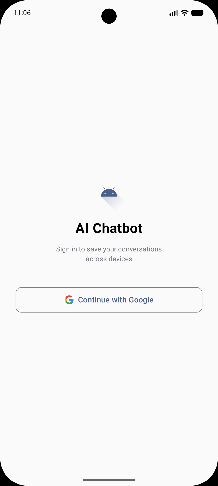
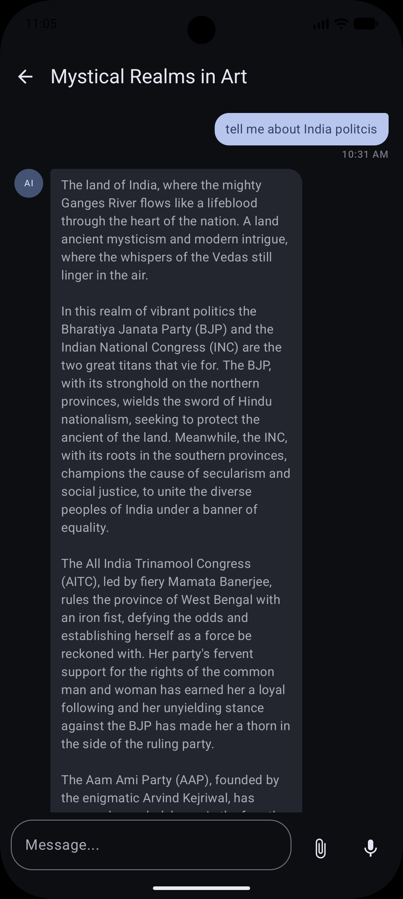
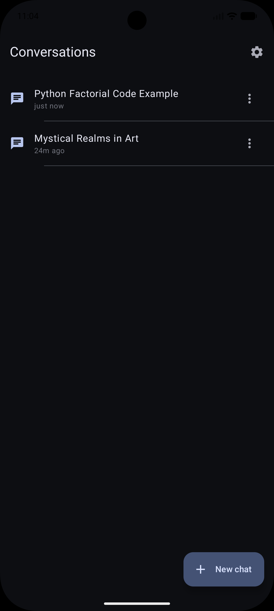
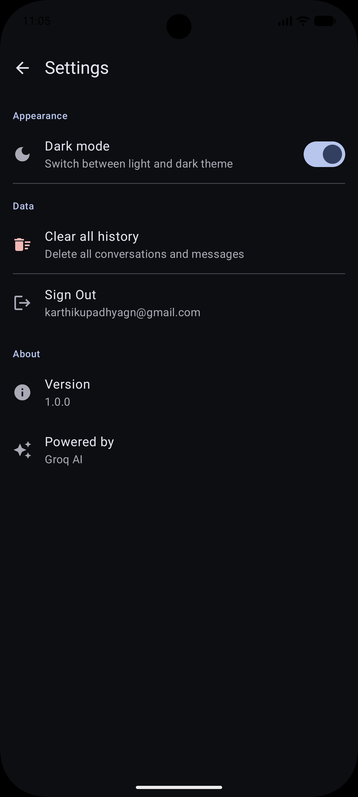

# 🤖 Android AI ChatBot

An AI-powered chat application for Android built with **Jetpack Compose**, **Clean Architecture**, and **Groq API** for real-time streaming responses. Features Google Sign-In, conversation history, voice input, and image understanding.

---

## 📱 Screenshots

| Login                                                | Chat                                                | History                                                | Settings                                                |
|------------------------------------------------------|-----------------------------------------------------|--------------------------------------------------------|---------------------------------------------------------|
|  |  |  |  |
---

## ✨ Features

- 🔐 **Google Sign-In** — Firebase Authentication with secure login/logout
- 💬 **Real-time AI Streaming** — Token-by-token response streaming using SSE (Server-Sent Events)
- 🖼️ **Image Understanding** — Attach images from gallery and ask the AI about them
- 🎙️ **Voice Input** — Speak your message using the device microphone
- 📝 **Conversation History** — All chats saved locally with Room database
- 🏷️ **Auto Title Generation** — Conversations are automatically named based on the first message
- 🌙 **Dark Mode** — Persistent dark/light theme toggle via DataStore
- 🗑️ **Clear History** — Delete all conversations with confirmation dialog
- ⚙️ **Settings Screen** — Manage theme, account, and data

---

## 🏗️ Architecture

This project follows **Clean Architecture** with **MVVM** pattern, separating concerns into three layers:

```
app/
├── core/
│   ├── di/                      # Hilt dependency injection modules
│   └── network/                 # OkHttp interceptors, NetworkMonitor, NetworkResults
│
├── data/
│   ├── local/                   # Room database, DAOs, Entities
│   └── repository/              # Repository implementations (ChatRepositoryImpl, ConversationRepositoryImpl)
│
├── domain/
│   ├── model/                   # Domain models (Message, Conversation, ChatState)
│   ├── repository/              # Repository interfaces (ChatRepository, ConversationRepository)
│   └── usecase/                 # Use cases (SendMessageUseCase, GetMessagesUseCase, etc.)
│
└── feature/
    ├── auth/                    # Login screen + AuthViewModel
    ├── chat/                    # Chat screen + ChatViewModel
    ├── history/                 # History screen + HistoryViewModel
    └── settings/                # Settings screen + SettingsViewModel
```

### Why Clean Architecture?

- **Separation of concerns** — UI, business logic, and data are fully independent
- **Testability** — Each layer can be unit tested in isolation
- **Scalability** — Easy to swap API providers or databases without touching UI code

---

## 🛠️ Tech Stack

| Category | Technology |
|---|---|
| Language | Kotlin |
| UI | Jetpack Compose + Material 3 |
| Architecture | Clean Architecture + MVVM |
| DI | Hilt (with KSP) |
| Database | Room |
| Networking | Retrofit + OkHttp |
| Streaming | SSE (Server-Sent Events) via OkHttp |
| Auth | Firebase Authentication (Google Sign-In) |
| Preferences | DataStore |
| Navigation | Navigation Compose |
| AI Provider | Groq API (llama-3.1-8b-instant) |
| Image Loading | Coil |
| Async | Kotlin Coroutines + Flow |

---

## 🚀 Getting Started

### Prerequisites

- Android Studio Hedgehog or newer
- Android device or emulator running API 24+
- A free [Groq API key](https://console.groq.com)
- A Firebase project with Google Sign-In enabled

---

### 1. Clone the Repository

```bash
git clone https://github.com/yourusername/android-ai-chatbot.git
cd android-ai-chatbot
```

---

### 2. Set Up Groq API Key

1. Go to [console.groq.com](https://console.groq.com) and create a free account
2. Generate an API key
3. Open `local.properties` in the root of the project (create it if it doesn't exist)
4. Add the following:

```properties
sdk.dir=/path/to/your/Android/sdk
API_KEY=your_groq_api_key_here
MODEL=llama-3.1-8b-instant
```

> ⚠️ Never commit `local.properties` to version control. It is already in `.gitignore`.

---

### 3. Set Up Firebase

1. Go to [console.firebase.google.com](https://console.firebase.google.com)
2. Create a new project
3. Add an Android app with package name `com.example.android_ai_chatbot`
4. Enable **Google Sign-In** under Authentication → Sign-in method
5. Download `google-services.json` and place it in the `app/` folder
6. Add your debug SHA-1 fingerprint:

```bash
# Run this in the project root to get your SHA-1
./gradlew signingReport
```

Copy the `SHA-1` value from the debug variant and add it in:
Firebase Console → Project Settings → Your App → Add fingerprint

7. Re-download `google-services.json` after adding the fingerprint

---

### 4. Build and Run

Open the project in Android Studio, let Gradle sync, then click **Run**.

---

## 🔑 Environment Variables

All sensitive configuration is stored in `local.properties` and exposed to the app via `BuildConfig`:

| Key | Description |
|---|---|
| `API_KEY` | Your Groq API key |
| `MODEL` | The AI model to use (e.g. `llama-3.1-8b-instant`) |

These are injected at build time and never hardcoded in source files.

---

## 📡 How Streaming Works

The app uses **Server-Sent Events (SSE)** to stream AI responses token by token:

1. User sends a message
2. A `POST` request is made to `https://api.groq.com/openai/v1/chat/completions` with `"stream": true`
3. The response body is read line by line using OkHttp's `ResponseBody.source()`
4. Each `data: {...}` line is parsed as a `OpenAIStreamChunk`
5. The token is extracted from `choices[0].delta.content` and emitted via Kotlin `Flow`
6. The UI collects the flow and appends each token to the message bubble in real time

```
User sends message
      ↓
SendMessageUseCase → ChatRepository.sendMessageStream()
      ↓
Retrofit @Streaming POST → Groq API
      ↓
OkHttp reads SSE line by line
      ↓
Each token emitted via Flow<String>
      ↓
ChatViewModel collects → updates Room DB
      ↓
ChatScreen LazyColumn re-renders with each token
```

---

## 🗄️ Database Schema

### conversations
| Column | Type | Description |
|---|---|---|
| id | TEXT (PK) | UUID |
| title | TEXT | Auto-generated conversation title |
| createdAt | INTEGER | Unix timestamp |
| updatedAt | INTEGER | Unix timestamp (updated on each message) |

### messages
| Column | Type | Description |
|---|---|---|
| id | TEXT (PK) | UUID |
| conversationId | TEXT (FK) | References conversations.id with CASCADE delete |
| content | TEXT | Message text |
| role | TEXT | "USER" or "ASSISTANT" |
| timestamp | INTEGER | Unix timestamp |
| isStreaming | INTEGER | Boolean — true while AI is still generating |
| imageUri | TEXT | URI of attached image (nullable) |

---

## 📁 Key Files Reference

| File | Purpose |
|---|---|
| `ChatRepositoryImpl.kt` | Handles SSE streaming, message persistence, title generation |
| `ChatViewModel.kt` | Manages chat UI state, sends messages, handles streaming lifecycle |
| `AppModules.kt` | Hilt DI modules — networking, database, auth, repositories |
| `OpenAIApiService.kt` | Retrofit interface for Groq API (OpenAI-compatible) |
| `AuthRepository.kt` | Firebase + Credential Manager Google Sign-In logic |
| `MainActivity.kt` | App entry point, NavGraph, dark mode theming |
| `ChatScreen.kt` | Chat UI — message bubbles, input bar, voice, image picker |
| `HistoryScreen.kt` | Conversation list with rename/delete options |
| `SettingsScreen.kt` | Dark mode toggle, clear history, sign out |

---

## 🧪 Testing

The project includes unit test setup with:

- **JUnit4** — test runner
- **MockK** — Kotlin-friendly mocking library
- **Turbine** — Flow testing utility
- **kotlinx-coroutines-test** — coroutine test dispatcher

Run tests with:
```bash
./gradlew test
```

---

## 🔄 Switching AI Models

To use a different Groq model, update `local.properties`:

```properties
# Fast and free
MODEL=llama-3.1-8b-instant

# More capable, still free
MODEL=llama-3.3-70b-versatile

# Vision/image support
MODEL=meta-llama/llama-4-scout-17b-16e-instruct
```

No code changes needed — the model name is injected via `BuildConfig.MODEL`.

---

## 🤝 Contributing

1. Fork the repository
2. Create a feature branch (`git checkout -b feature/your-feature`)
3. Commit your changes (`git commit -m 'Add your feature'`)
4. Push to the branch (`git push origin feature/your-feature`)
5. Open a Pull Request

---

## 📄 License

```
MIT License

Copyright (c) 2026 Karthik

Permission is hereby granted, free of charge, to any person obtaining a copy
of this software and associated documentation files (the "Software"), to deal
in the Software without restriction, including without limitation the rights
to use, copy, modify, merge, publish, distribute, sublicense, and/or sell
copies of the Software, and to permit persons to whom the Software is
furnished to do so, subject to the following conditions:

The above copyright notice and this permission notice shall be included in all
copies or substantial portions of the Software.
```

---

## 👤 Author

**Karthik**
- Built as a resume project demonstrating Android development with AI integration
- Stack: Kotlin, Jetpack Compose, Clean Architecture, Hilt, Room, Groq API, Firebase

---

> 💡 **Note for interviewers:** This project demonstrates production-level Android patterns including Clean Architecture, dependency injection, reactive streams with Flow, real-time SSE streaming, and Firebase authentication — all in a fully functional AI chat application.
